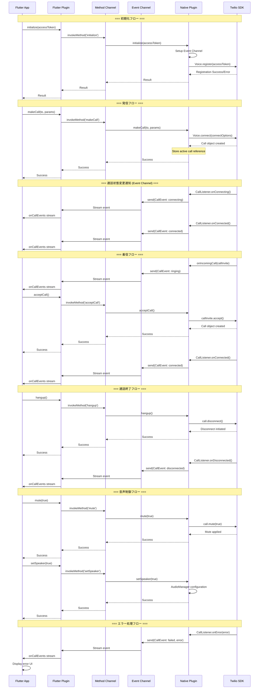
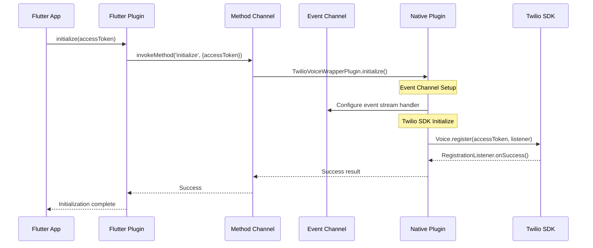
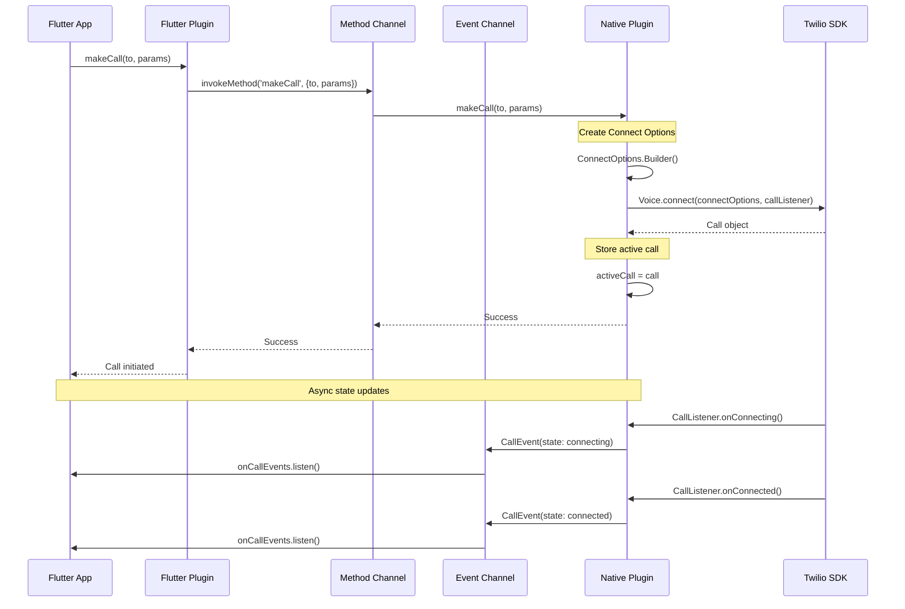
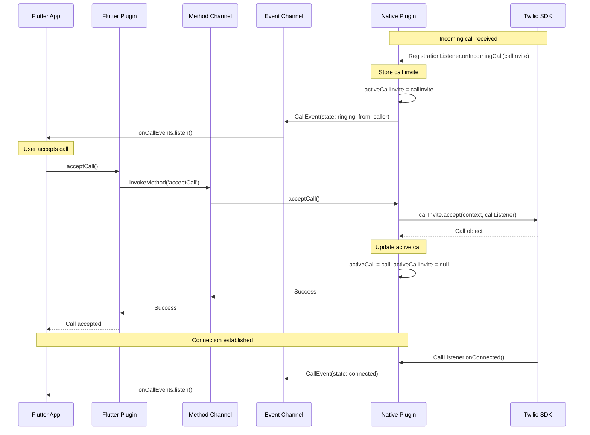

# Twilio Voice Wrapper - シーケンス図

## 概要

このドキュメントでは、Twilio Voice WrapperプラグインのMVP機能における処理フローをシーケンス図で示します。

## 処理フロー全体図

## 詳細フロー

### 1. 初期化フロー

SDK の初期化とEvent Channel の設定を行います。

### 2. 発信フロー

電話番号またはSIPアドレスへの発信を開始します。

### 3. 着信応答フロー

着信通話の受信と応答処理を行います。

## Platform Channels 詳細

### Method Channel
- **チャンネル名**: `twilio_voice_wrapper`
- **用途**: 同期的な操作指示
- **メソッド一覧**:
  - `initialize`
  - `makeCall`
  - `acceptCall`
  - `hangup`
  - `mute`
  - `setSpeaker`

### Event Channel
- **チャンネル名**: `twilio_voice_wrapper/events`
- **用途**: 非同期の状態通知
- **イベント内容**: CallEvent オブジェクト

## エラーハンドリング

### 操作エラー
Method Channel のレスポンスでエラー情報を返します。

### 非同期エラー
Event Channel で `CallEvent(state: failed, error: message)` を送信します。

## 実装時の考慮点

1. **Native側でのCall オブジェクト管理**
   - アクティブな通話の参照を保持
   - CallInvite と Call の適切な管理

2. **Event Channel の初期化タイミング**
   - SDK初期化時に Event Channel も準備
   - アプリ起動時から状態監視可能

3. **スレッド管理**
   - Twilio SDK のコールバックは適切なスレッドで処理
   - UI更新のためのメインスレッド考慮

4. **状態管理**
   - 通話状態の整合性を保持
   - 複数の状態変更イベントの順序管理